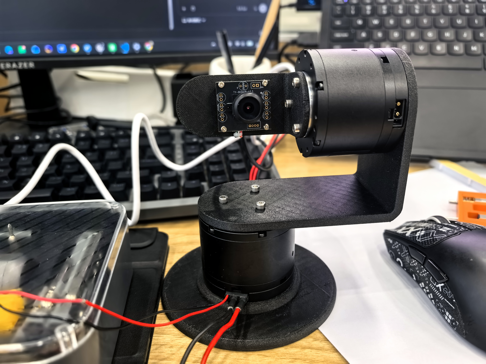
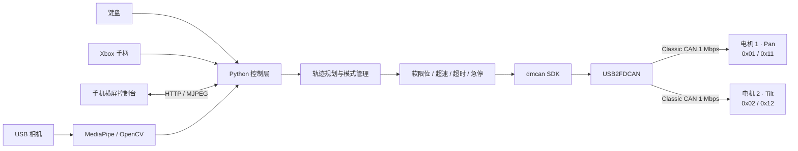

# DM4310 云台相机

<p align="center">
  
</p>

<p align="center">
  基于双 DM-J4310 电机、USB2FDCAN 与机器视觉构建的双轴智能云台相机
</p>

<p align="center">
  
  
  
  
  
</p>

## 项目简介

这是一个从电机通信、运动控制、机械结构到视觉交互完整落地的双轴云台项目。
系统通过 USB2FDCAN 控制两台 DM-J4310 电机，支持键盘、Xbox 手柄和手机
局域网遥控，并使用相机完成实时画面回传、人脸跟随与手部跟随。

项目不只实现了“让电机转起来”，还围绕真实硬件补充了 S 曲线启停、软限位、
反馈超时保护、超速保护、静摩擦补偿、平滑归零、动作录制复现和断联自动失能，
形成了一套可交互、可演示、可继续扩展的云台控制系统。

## 核心功能

- **双轴实时控制**：经典 CAN 1 Mbps，同一总线独立控制水平轴与俯仰轴。
- **多种交互方式**：键盘、Xbox 左摇杆、手机横屏虚拟摇杆均可控制速度和方向。
- **机器视觉跟随**：基于 MediaPipe 与 OpenCV 实现人脸、手部目标检测和云台闭环跟随。
- **局域网控制台**：手机端同时提供摇杆、实时 MJPEG 画面、状态遥测与功能按钮。
- **位置与动作记忆**：保存/返回双电机位置，录制位置—时间轨迹并自适应复现。
- **拖动示教**：手动拖动一台电机，另一台电机按相对角度同步跟随。
- **高精度归零**：限速、限加速度接近零点，使用捕获区与积分前馈补偿静摩擦。
- **安全保护**：急停、软限位、超速、反馈错误、相机丢失、手柄断开和网络断联保护。

## 演示视频

GitHub README 无法稳定内嵌仓库内的 MP4，点击下表中的链接可直接查看原始演示。

| 阶段 | 演示 | 说明 |
| --- | --- | --- |
| 01 | [达妙官方调试软件驱动电机](./达妙官方调试软件驱动电机.mp4) | 核对电机参数、CAN ID 与通信链路 |
| 02 | [Python 驱动电机](./python驱动电机.mp4) | 通过 USB2FDCAN SDK 完成使能、控制与反馈解析 |
| 03 | [Python 键盘控制单电机](./基于python键盘控制电机.mp4) | 按键速度控制与快速平滑启停 |
| 04 | [Python 键盘控制双电机](./基于python键盘控制双电机.mp4) | 两个方向键组独立控制云台双轴 |
| 05 | [一台电机示教另一台电机](./一个电机控制另一个电机.mp4) | 拖动示教与相对角度跟随 |
| 06 | [Xbox 手柄控制云台](./xbox手柄控制云台.mp4) | 摇杆幅度映射目标速度 |
| 07 | [人脸自动跟随](./人脸跟随.mp4) | 人脸中心偏差驱动双轴闭环跟随 |
| 08 | [手部自动跟踪](./手部自动跟踪.mp4) | 使用手部关键点控制云台视线 |
| 09 | [局域网设备控制云台](./局域网设备控制云台.mp4) | 手机横屏控制、状态显示与相机画面回传 |

## 系统架构



## 技术实现

### 电机与总线

- 两台 DM-J4310 共用 CAN_H/CAN_L，总线两端配置 120 Ω 终端电阻。
- 电机 1 使用 Slave/Master ID `0x01/0x11`，电机 2 使用 `0x02/0x12`。
- 通过 `dmcan-sdk` 调用 USB2FDCAN，使用经典 CAN 1 Mbps 和 MIT 控制报文。
- 解码位置、速度、转矩、状态与错误码，任一轴异常时联动失能两台电机。

### 运动控制

- 使用限速度、限加速度的速度/位置轨迹，避免阶跃指令冲击机械结构。
- 归零过程根据剩余制动距离调整速度，在零点附近切换到位置捕获阶段。
- 对位置反馈的 ±12.5 rad 回绕进行连续化处理，防止跨量程误判和突然高速旋转。
- 使用渐增位置刚度与限幅积分前馈克服减速器静摩擦，将归零目标误差设为
  `0.005 rad`。
- 动作复现采用自适应时间轴：跟随误差增大时减慢或暂停轨迹，待电机追上后继续。

### 视觉与交互

- 人脸跟随使用 MediaPipe 人脸检测结果，并以关键点中心作为稳定跟踪目标。
- 手部跟随使用 21 个关键点中的掌根和指根区域估计掌心，降低手指动作带来的抖动。
- 视觉控制加入中心死区、目标丢失超时、速度上限和加速度限制。
- 手机端为横屏布局：左侧虚拟摇杆、中间实时画面、右侧自动功能与安全按钮。
- 控制页面使用随机访问令牌；摇杆数据停止 `0.25 s` 后减速，断联超过 `1.2 s`
  自动失能。

## 开发经历

### 1. 打通硬件链路

首先使用达妙官方调试工具确认电机能够校准和转动，并读取固件、电压、CAN ID
与波特率。调试中发现设备虽然在 Windows 中显示为 COM 口，但实际控制接口是
USB2FDCAN SDK，而不是普通串口透传；随后改用 `dmcan-sdk` 完成经典 CAN 报文收发，
解决了“串口有输出但 CAN 帧无法发送”的问题。

### 2. 从单电机测试到安全运动控制

完成使能、MIT 指令打包、反馈解析和异常失能后，先以低速验证单电机正反转。
随后加入 S 曲线缓启动/缓停止、方向映射和相对软限位，使按键控制既敏捷又不会
对结构产生明显冲击。

### 3. 改进高精度归零算法

早期位置插值归零在编码器回绕附近出现过位置跳变和瞬时高速，接近零位时又受到
减速器静摩擦影响，存在稳态误差。为此重新设计两阶段归零：远端采用制动距离限速，
近端先降速再渐增位置刚度，同时加入带限幅、带抗饱和的积分前馈。最终将归零判定
改为“位置与速度同时满足并持续稳定”，目标误差收紧到 `0.005 rad`。

### 4. 扩展双轴、示教与手柄控制

第二台电机接入同一 CAN 总线后，为两轴建立独立 ID、状态与软限位，并实现键盘
并行控制。随后加入拖动示教功能：电机 2 提供低力矩摩擦补偿以便手动拖动，电机 1
跟随其相对角度。Xbox 控制则加入圆形死区、响应曲线、主轴锁定与平滑加减速，减少
上下推动时误触左右轴的问题。

### 5. 加入视觉闭环

在人脸检测方案中，从受光照和侧脸影响较大的传统分类器切换到 MediaPipe；手部跟随
则选取较稳定的掌心区域而不是单个指尖。视觉偏差被转换为两轴目标速度，同时设置
中心死区、目标丢失停车和人工摇杆接管，让自动跟随不会与手动控制争抢控制权。

### 6. 实现动作录制与鲁棒复现

系统以固定周期记录两轴位置和相对时间。直接按原时间播放时，实际电机可能因速度、
负载不同而产生过大跟随误差，因此加入“先返回录制起点 + 自适应时间轴”策略：误差
增大时自动放慢，超过暂停阈值时等待电机追上，仅在触发硬保护阈值时失能。

### 7. 完成局域网手机控制台

最后将手柄端功能迁移到手机横屏网页，整合虚拟摇杆、实时遥测、人脸/手部跟随、
位置记忆、动作录制复现和 MJPEG 画面回传。服务端加入访问令牌、控制心跳和断联
看门狗，使手机可以作为无需安装 App 的便携控制器。

### 8. 机械结构迭代

根据两台电机和相机的实际尺寸设计底盘、云台连接件与相机固定架，并保留 SolidWorks
源文件及 STEP 通用格式，完成从控制算法到实体装配的闭环验证。

## 安全机制

真实电机控制具有风险，项目默认采用以下保护：

- 启动位置附近的相对软限位，防止机构持续绕线或碰撞。
- 超速、错误码、反馈中断、手柄断开和网络断联触发停车或失能。
- 自动跟随、回位和动作复现过程中，人工摇杆输入可立即接管。
- 手机端提供急停按钮，脚本在 `Ctrl+C`、异常或正常退出时发送失能指令。
- 运行任一控制脚本前，应关闭 DMTool 等其他占用 USB2FDCAN 的程序。

> 首次运行请悬空或固定机构、降低速度，并确保随时可以切断 24 V 电源。

## 快速开始

### 1. 环境

- Windows 10/11
- Python 3.13（项目验证环境为 Conda base）
- 达妙 USB2FDCAN 与两台 DM-J4310
- 24 V 直流电源
- USB 相机；Xbox 手柄为可选设备

### 2. 安装依赖

```powershell
Set-Location .\dm4310_python
python -m pip install -r requirements.txt
```

运行前关闭 DMTool 和 USB2CAN 图形工具，避免设备被重复占用。

### 3. 选择控制方式

```powershell
# 单电机低速验证
python dm4310_usb2fdcan.py

# 双轴键盘控制
python dm4310_dual_keyboard.py

# Xbox 手柄、视觉跟随、位置记忆和动作录制
python dm4310_dual_gamepad.py

# 手机局域网控制与视频回传
python dm4310_mobile.py
```

更完整的接线、参数和各脚本使用方法见
[Python 控制说明](./dm4310_python/README.md)。

## 项目结构

```text
云台相机/
├─ README.md                         # GitHub 项目主页
├─ 成品图.jpg                        # 实物展示
├─ *.mp4                            # 功能演示视频
├─ *.SLDPRT / *.SLDASM / *.STEP     # 机械设计源文件与通用模型
└─ dm4310_python/
   ├─ dm4310_usb2fdcan.py           # 单电机通信与低速测试
   ├─ dm4310_home.py                # 高精度平滑归零
   ├─ dm4310_keyboard.py            # 单电机键盘控制
   ├─ dm4310_dual_keyboard.py       # 双电机键盘控制
   ├─ dm4310_teach_follow.py        # 拖动示教跟随
   ├─ dm4310_dual_gamepad.py        # 手柄、视觉、录制复现主程序
   ├─ dm4310_face_tracker.py        # 人脸与手部检测封装
   ├─ dm4310_mobile.py              # 局域网手机控制服务
   ├─ mobile_controller.html        # 手机横屏控制界面
   ├─ dm4310_web.py                 # 单轴网页位置控制服务
   └─ requirements.txt              # Python 依赖
```

## 后续计划

- 接入小智 AI 语音，通过 MCP 将自然语言安全映射为跟随、回位、录制和急停等离散工具。
- 增加双轴机械零位开关与上电自动标定。
- 将相机跟踪升级为带目标选择和丢失重识别的多目标跟踪。
- 保存动作轨迹到文件，并提供轨迹编辑、命名和管理界面。

## 说明

本仓库面向个人学习、机器人控制实验和作品集展示。项目直接驱动真实电机，复现时请
根据自己的机械结构重新确认 CAN ID、安装方向、软限位、电源能力和急停方案。
